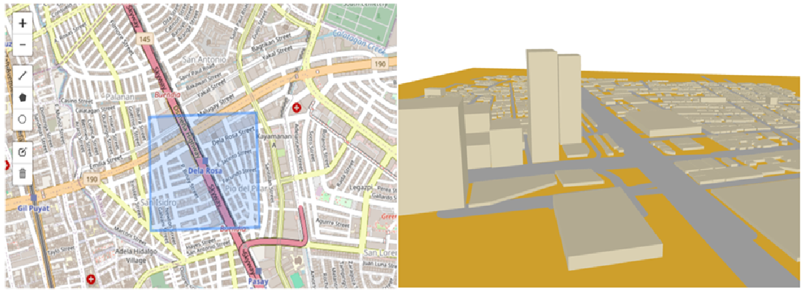

# Create Scene file from Openstreetmap data for Sionna Ray Tracing
This is a utility project which generates [Mitsuba](https://www.mitsuba-renderer.org/) compatible 3D scene file along with 3D objects of buildings, Ground and Roads using Openstreetmap data. Files generated using [OSM_to_Sionna](./OSM_to_Sionna.ipynb) can be directly used as input to [Sionna](https://github.com/NVlabs/sionna) Ray tracing applications.

 
### Process Overview ###
